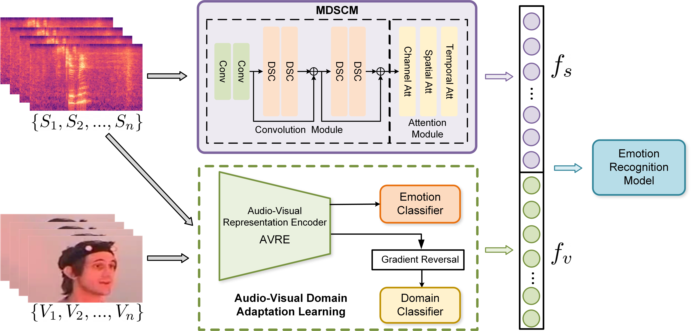

# Audio-Visual Domain Adaptation Feature Fusion for Speech Emotion Recognition

PyTorch implementation for the paper:

- Title: Audio-Visual Domain Adaptation Feature Fusion for Speech Emotion Recognition

- Authors: Jie Wei, Guanyu  Hu, Xinyu  Yang, Luu Anh Tuan, Yizhuo  Dong




## Getting Started

```git
git clone https://github.com/Janie1996/AV4SER.git
```

## Requirements

You can create an anaconda environment with:

```
conda env create -f environment.yaml
conda activate AV4SER
```

## Usage

### 1. Preparation

a. Download dataset from [google-drive](https://drive.google.com/file/d/1i5-tr_ZD4WgiGa4ossSo3vP6k8pwIVFp/view?usp=sharing). Unzip it and put them under `./DATA/`

b. Download model checkpoint from [google-drive](https://drive.google.com/file/d/1JBD8QceajR2xOpyx7wHxIToq-BLUV-lZ/view?usp=sharing). Unzip it and put them under `./Checkpoint/`

### 2. Test

- Run MDSCM only

  `python AudioExperiment/evaluation.py`

- Run AVDAL only

  `python DomainExperiment/evaluation.py`

- Run proposed

  `python FusionExperiment/SER.py`

### 3. Train

Coming soon ...


If you have questions, feel free to contact weijie_xjtu@stu.xjtu.edu.cn

## Acknowledgements

